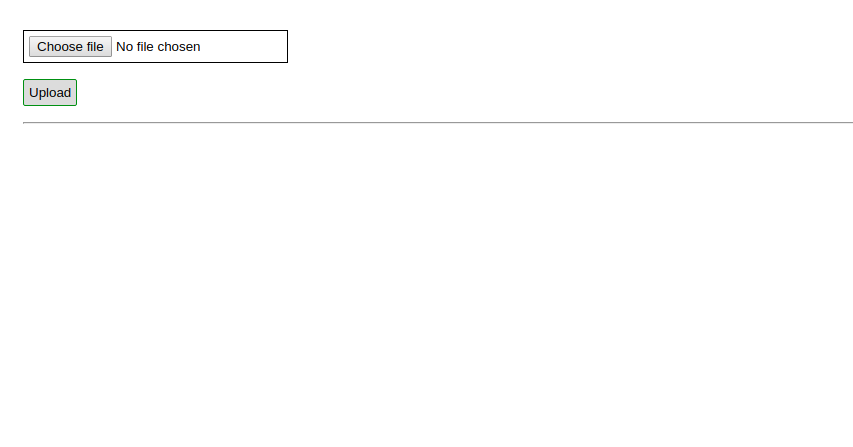
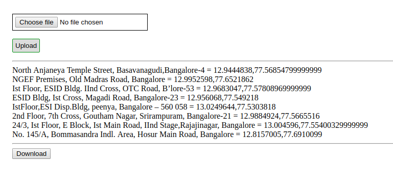

 Uploading and processing the Excel file in Django 

- Clone this repo to your system.

- Create a virtual environment and activate it.

- Install the dependencies using `pip install -r requirement.txt`.

- Start the python server, `python manage.py runserver`.

- Go to `localhost:8000` and upload the `user_data.xls` file. and download excel file.

Output :
-------------
# When web app start

# After inserting excel file 

